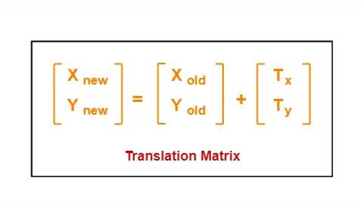

# 2D Translation Algorithm

**Translation** is a process in which the position of an object in a 2D plane is moved from its original position to a new position based on a given translation vector. Below is the step-by-step algorithm to perform the 2D translation operation.

## **Algorithm for 2D Translation**

1. Start the graphics mode using `initgraph()`.
2. Set background color (e.g., white) and clear the screen.
3. Define the coordinates of the original rectangle (`x1`, `y1`, `x2`, `y2`).
4. Ask the user to input translation values `tx` and `ty`.
5. Draw the original rectangle and label it.
6. Apply translation:
   - New coordinates:
     - `x1' = x1 + tx`
     - `y1' = y1 + ty`
     - `x2' = x2 + tx`
     - `y2' = y2 + ty`
7. Draw the translated rectangle using the new coordinates and label it.
8. Wait for user input, then close the graphics window.

---
## Matrics Form:
In Matrix form, the above translation equations may be represented as- 

- The **homogeneous coordinates** representation of a point **(X, Y)** is **(X, Y, 1)**.  
- Using this representation, all the transformations (such as translation, scaling, rotation) can be performed using **matrix/vector multiplications**.

---

### **Translation Matrix Representation in Homogeneous Coordinates:**

To translate a point by `(tx, ty)`, the transformation matrix is:

---
## 2D Translation Visualization:

Here is a visual representation of how the 2D Translation algorithm works:

---

## Documentation:

For a more detailed explanation of the 2D Translation algorithm, check out the full documentation:

[Click here for Documentation](https://drive.google.com/file/d/1Znpvm0swGvaYhtxQ1xFYPtr9QJh5-Tdn/view?usp=sharing)

---
## Required Tools:

- **Dev-C++ IDE**
- **WinBGIm Graphics Library** (included with or added to Dev-C++)
- **C++ Compiler** (such as TDM-GCC that comes with Dev-C++)
- **Windows Operating System** (Graphics.h is platform-specific)

